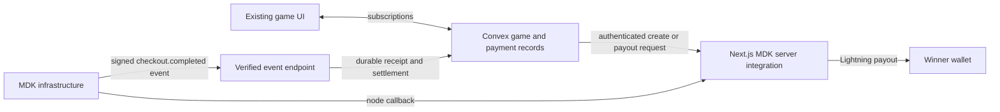

# Switching Last Pay Wins from LND to Money Dev Kit

Research date: 2026-09-04. Repository inspected at `c2f40cf`. This is a migration assessment; no application code, account settings, deployments, or payments were changed.

## Recommendation

Money Dev Kit (MDK) appears capable of replacing the old node for both incoming bids and outgoing winner payments. Keep Convex as the game database and scheduler, and put MDK's supported Next.js integration in the existing web app. Validate a complete receive → record bid → pay winner flow before switching production.

MDK removes the need to operate the existing standalone LND node. It still runs a self-custodial Lightning node inside the application's server infrastructure, using LDK. MDK supplies channel/liquidity infrastructure; the application must remain reachable to accept payments. The wallet is controlled by `MDK_MNEMONIC`, which needs secure backup. [How MDK works](https://docs.moneydevkit.com/howitworks)

This is a moderate payment integration change, with most of the care needed around game timing, accounting, and payout recovery rather than UI.

## Current payment flow

| Area | Current behavior | Migration impact |
| --- | --- | --- |
| Invoice creation | `convex/invoiceActions.ts` creates an LND invoice: default 100 sats, five-minute expiry. | Create an MDK checkout/payment and persist its provider reference and invoice. |
| Detection | `src/hooks/useConvexPresence.ts` sends a heartbeat every ten seconds; `convex/presence.ts` schedules an LND status check. | Receive verified server-side payment events; retain independent reconciliation. |
| Bid settlement | `convex/invoices.ts` changes pending → settled, then schedules `games.recordBid`. | Deduplicate provider events and apply the payment and bid atomically. |
| Game | `convex/games.ts` adds the configured gross bid amount, resets the clock using processing time, and schedules game completion. | Define authoritative payment ordering and account for net funds. |
| Winner payout | `convex/actions.ts` calls `payLightningAddress` in `convex/lightning.ts`, which sends through LND. | Replace with MDK programmatic payout and persistent payout tracking. |
| UI | `useConvexInvoice`, `Invoice.tsx`, `Qr.tsx`, and WebLN consume a BOLT11 string. | Preserve this interface if the SDK's headless flow is validated. |
| Other dependencies | Next.js address-validation routes import `src/lib/lightning.ts`, which eagerly imports required LND credentials. `/api/getinfo` calls LND directly. | Separate Lightning-address validation from LND; remove obsolete node routes and configuration. |

Local evidence: [invoice actions](../../convex/invoiceActions.ts), [invoice mutations](../../convex/invoices.ts), [presence](../../convex/presence.ts), [browser heartbeat](../../src/hooks/useConvexPresence.ts), [games](../../convex/games.ts), [payout action](../../convex/actions.ts), [LND adapter](../../convex/lightning.ts), [server environment](../../src/lib/serverEnvs.ts).

## Proposed boundaries

Install `@moneydevkit/nextjs`, apply its `withMdkCheckout` configuration helper, and expose the SDK's `/api/mdk` handler. Configure `MDK_ACCESS_TOKEN` and `MDK_MNEMONIC` only in the server environment. Use sat-denominated checkouts. [Next.js integration](https://docs.moneydevkit.com/nextjs)

The published 0.22.0 package declares support for Next.js 15/16 and React 18/19, matching this repo's Next.js 16/React 19. The corresponding core SDK exposes checkout creation/retrieval with a BOLT11 invoice, payment hash, and expiry, making preservation of the current QR/WebLN UI plausible. Validate that flow against the pinned release before committing to it. [Versioned package](https://www.npmjs.com/package/@moneydevkit/nextjs/v/0.22.0), [SDK source](https://github.com/moneydevkit/mdk-checkout/tree/62d045c5938495891f7ffa9481164f28a815074a/packages/core/src)

Treat the SDK's node callback endpoint and the game's payment-event endpoint as separate responsibilities. Verify signed `checkout.completed` events before changing game state. `standardwebhooks` validates the raw payload and signature headers. The documented event includes metadata, amount, and net amount, but its example lacks an explicit checkout ID: use an opaque, server-created payment-attempt reference in metadata and validate against stored expectations. A browser success screen must never authorize a bid. [Webhooks](https://docs.moneydevkit.com/webhooks)

Convex actions can call a narrowly scoped, authenticated Next.js adapter for invoice creation, status reconciliation, and payouts. Verified events can enter through a Convex HTTP action, provided the verification library works in its runtime, or through Next.js and an authenticated bridge. Keep settlement mutations internal; do not expose an unauthenticated `markPaid` mutation. Convex's generated guidelines already support HTTP actions calling internal mutations. [Convex runtimes](https://docs.convex.dev/functions/runtimes)

Using Next.js for the SDK is a recommendation based on MDK's documented integration, not a claim that a direct Convex integration is impossible. Proving native-package bundling and runtime compatibility in Convex would be additional scope. [Convex external packages](https://docs.convex.dev/functions/bundling)

## Necessary implementation work

1. **Reserve payment attempts before external calls.** Store a stable attempt ID, session, immutable payout address, expected sats, and applicable game/round policy. Serialize creation per session; the current query → external call → store sequence can issue multiple invoices concurrently. Recover attempts after ambiguous request failures rather than blindly creating new payable invoices.
2. **Extend payment records.** Add provider (`lnd` or `mdk`), checkout/payment reference, provider expiry, gross/net/fee amounts, provider payment time when available, and event receipt time. Keep BOLT11/payment-hash fields compatible with old records. Add indexes and a durable event inbox. Introduce optional fields first so historical LND rows remain valid.
3. **Make settlement transactional.** One Convex mutation should deduplicate the checkout/payment, validate amount/currency/reference, settle the record, insert its bid, and update the game. Use verified stored payout-address data. Do not discard a paid event merely because the local invoice expired or was replaced. Record unexpected or late payments for explicit resolution.
4. **Decouple payment processing from presence.** Keep heartbeat for online counts. Reconcile unresolved payment attempts on the server with bounded batches, including attempts whose browser has disconnected. MDK retries failed webhook deliveries but can disable an endpoint after five consecutive failures; this needs failure visibility. [Webhook delivery behavior](https://docs.moneydevkit.com/webhooks)
5. **Replace winner payouts.** Enable programmatic payouts, then use `programmaticPayout` and reconcile its result. Derive a stable idempotency key from the game/payout record; persist destination, amount, provider payment ID, and pending/succeeded/failed status. An accepted request or timeout is not proof of a successful transfer. Only send a paid-success notification after confirmed success. Leave automatic sweeping disabled so the prize balance remains available. [Payouts](https://docs.moneydevkit.com/dashboard/payouts)
6. **Remove LND dependencies after cutover.** Remove LND transport, certificate/macaroons, obsolete getinfo route, and unused dependencies after checking references. Preserve Lightning-address validation. Update fee text and payment/payout failure states in the UI.

## Game-specific decisions

### Payment ordering at the deadline

Today the winner is based on when `recordBid` runs, not the Lightning payment time. Webhooks improve detection but can arrive late or out of order. Simply replacing `Date.now()` with a provider timestamp will not fix an already-finalized game.

Before launch, choose and document either server-confirmed receipt ordering, or provider payment-time ordering with verified timestamp semantics, deterministic ties, a finalization/reconciliation window, and a late-payment policy. Never let an old callback silently start or alter a later round. Payout must wait until the round is final under the chosen rule. The SDK/provider timestamp semantics and notification latency require a real integration check.

The inspected checkout contract does not expose `paidAt` or `settledAt`; the business webhook's envelope timestamp is not documented as Lightning settlement time. Payment-time ordering therefore remains unproven. [Provider research and contract references](money-dev-kit-provider.md)

### Fee funding

MDK currently advertises a **2% public-beta transaction fee**, without a monthly or setup fee. Treat this as current advertised pricing and verify the actual charged amount and rounding during the pilot. [Pricing](https://moneydevkit.com/)

The current code promises the whole jackpot below 20,000 sats and deducts 10% only at or above that threshold. Assuming 2% is deducted from each payment, 100 bids of 100 sats yield 10,000 sats gross and approximately 9,800 sats net, before outgoing routing costs. Paying 10,000 sats would require an external reserve.

Choose either a jackpot based on verified net receipts with a routing reserve, an explicit entry fee, or an operator-funded subsidy. Carry actual amounts into `recordBid`; it currently reads a global configured amount instead of the paid invoice amount. Keep displayed fees and promised winnings consistent with the chosen model.

### Limits and balance

Published default programmatic limits are 1,000,000 sats per payout and 5,000,000 sats per rolling 24 hours. Handle insufficient balance, destination failures, and limits without losing the winner's unpaid obligation. The dashboard reserves some balance for routing. [Payout limits](https://docs.moneydevkit.com/dashboard/payouts)

## Validation and cutover

One concrete SDK concern deserves investigation during the pilot: published core 0.22.0 catches a failure while reporting a received Lightning payment to MDK's API and logs it, with a source TODO describing a possible mismatch between received funds and checkout status. This is a source-code observation, not a reproduced production failure. Ordinary checkout polling alone may not repair that mismatch; establish a supported recovery/reconciliation path before running a live prize pool. The same receive handler uses a native-node/outbound-WebSocket loop, a 60-second quiet grace, and a 300-second maximum lifetime, so deployment runtime and function duration need verification. [Pinned receive-handler source](https://github.com/moneydevkit/mdk-checkout/blob/62d045c5938495891f7ffa9481164f28a815074a/packages/core/src/handlers/webhooks.ts)

- First prove a small sat checkout and programmatic winner payout on an isolated, publicly reachable deployment. MDK's local-testing instructions use a tunnel and production payments; do not assume a Stripe-style sandbox exists. [Local testing](https://docs.moneydevkit.com/troubleshooting)
- Validate the exact deployed SDK version, native bundling, custom BOLT11 flow, expiry, payment timestamps, webhook metadata, fee rounding, payout status, and cold-start/concurrent-request behavior. Provider/API details are collected in [the companion provider research](money-dev-kit-provider.md).
- Add focused payment tests: duplicate/forged callbacks, wrong amounts, simultaneous settlements, expiry followed by delayed success, disconnected browser, callback-before-record race, deadline ordering, payout timeout/retry, failed payout, and insufficient funds. Run the repo's lint/type checks and production build. This research-only change does not require executing payments or application tests.
- Pause new bids for cutover, finish or explicitly resolve the active round, and inventory outstanding LND invoices and unpaid prizes. Start new invoices on MDK while preserving historical records. An old LND invoice cannot be converted to an MDK invoice; switching providers does not recover funds on the offline node. Existing liabilities need reconciliation and funding separately.

## Effort estimate

Planning estimate, not a measured delivery promise: about **half to one day** to prove the deployed receive/payout integration, and **another two to four engineering days** for the Convex bridge, event reconciliation, payout ledger, accounting, UI continuity, and meaningful failure testing. Timing rules or unsupported SDK behavior could expand that scope. The first milestone should be the complete small-value receive-and-pay loop, followed by the production migration.
